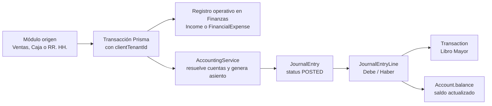

# Guía técnica: integración de transacciones entre Finanzas y Contabilidad

**Proyecto:** NovaHub ERP

**Alcance:** Ventas, Facturación por Caja, Nómina, Capacitaciones y Beneficios

**Última revisión del código:** 2026-08-12

Esta guía explica cómo una operación de negocio termina registrada en:

1. **Finanzas**, como ingreso, gasto o recurrencia operativa.
2. **Contabilidad**, como un asiento del Libro Diario.
3. **Libro Mayor y saldos**, mediante las líneas del asiento y sus movimientos derivados.

La intención es que otro programador pueda replicar el comportamiento en un nuevo módulo sin crear asientos duplicados, romper la separación por empresa o dejar una operación guardada sin su correspondiente trazabilidad contable.

## 1. Idea central

En NovaHub no debe existir una lógica contable distinta por cada pantalla. La lógica común es:



La regla más importante es:

> **Finanzas conserva el hecho económico operativo; Contabilidad conserva el asiento balanceado. `JournalEntry` es la fuente de verdad del Libro Diario y del Libro Mayor.**

El registro de Finanzas no debe incrementar o disminuir el saldo de la cuenta si el mismo proceso va a generar un asiento contable. De lo contrario, el saldo se actualizaría dos veces. Por eso existen opciones internas como `skipAccountingJournal`, `skipAccountBalance` y `skipAccountBalanceUpdate`.

## 2. Arquitectura y archivos principales

### 2.1 Motor contable

Archivo principal:

`Backend/src/accounting/accounting.service.ts`

Métodos que deben reutilizar los demás módulos:

| Método | Responsabilidad |
|---|---|
| `getMappedAccountId()` | Resuelve una cuenta a partir de `moduleKey`, `fieldKey` y el código configurado para el tenant. |
| `getConfiguredPaymentAccountId()` | Resuelve la cuenta de Activo según la forma de pago: efectivo, tarjeta, transferencia, cheque u otro. |
| `isAutoGenerationEnabled()` | Comprueba `AccountingConfig.config.autoGenEnabled`. |
| `autoGenerateFromPaidInvoice()` | Genera el asiento consolidado de una factura de venta totalmente pagada. |
| `autoGenerateFromPayment()` | Genera el asiento de un anticipo o cobro sin factura liquidada; si la factura queda pagada, redirige al asiento consolidado. |
| `autoGenerateFromExpense()` | Genera el asiento genérico de un gasto pagado, incluido el de capacitaciones y beneficios cuando se marca como pagado. |
| `autoGenerateFromPayroll()` | Genera el asiento consolidado de una nómina pagada. |
| `autoGenerateFromCashRegisterSession()` | Registra sobrantes o faltantes del cierre de caja. |
| `createPostedEntry()` | Valida, crea y publica el `JournalEntry`, crea sus `Transaction` y actualiza saldos. Es privado y debe invocarse mediante un método público específico del proceso. |

El módulo está marcado como global en `Backend/src/accounting/accounting.module.ts`, por lo que `AccountingService` puede ser inyectado por Ventas, Finanzas, Caja y RR. HH.

### 2.2 Finanzas

Archivo principal:

`Backend/src/financials/financials.service.ts`

Métodos relevantes:

- `createIncome()`: crea un registro `Income`. Si se crea con generación automática habilitada y sin `skipAccountingJournal`, llama a `autoGenerateFromIncome()`.
- `createExpense()`: crea un `FinancialExpense`. Si el estado es `PAID`, el importe es positivo y no se envía `skipAccountingJournal`, llama a `autoGenerateFromExpense()`.
- `updateExpense()`: cuando un gasto existente pasa a `PAID`, puede generar el asiento dentro de la misma transacción.
- `createRecurringExpense()`: crea la recurrencia y su primer gasto en estado `PENDING`.
- `processRecurringExpenses()`: el cron diario crea nuevos gastos recurrentes en estado `PENDING`.

Finanzas y Contabilidad usan el mismo catálogo `Account`. El campo `accountId` en `Income` o `FinancialExpense` identifica la cuenta económica principal del registro auxiliar; las cuentas finales debitadas y acreditadas se guardan en `JournalEntryLine`.

### 2.3 Modelos Prisma que forman el vínculo

En `Backend/prisma/schema.prisma`:

| Modelo | Uso |
|---|---|
| `Account` | Plan de cuentas por empresa. Tiene `clientTenantId`, tipo, estado y si acepta movimientos. |
| `AccountingConfig` | Configuración JSON por tenant, incluyendo `autoGenEnabled` y `accountMappings`. |
| `JournalEntry` | Cabecera del asiento. Guarda `status`, `referenceType` y `referenceId`. |
| `JournalEntryLine` | Líneas del asiento con `accountId`, `debit` y `credit`. |
| `Transaction` | Movimiento derivado que alimenta el Libro Mayor. Se crea una fila por línea del asiento. |
| `Income` | Registro financiero de un ingreso. |
| `FinancialExpense` | Registro financiero de un gasto. |
| `FinancialRecurringExpense` | Plantilla de gasto recurrente. |
| `Invoice` | Factura de venta. |
| `PaymentReceived` | Cobro recibido. Se vincula con `Invoice` mediante `invoiceId`. |
| `Payroll` | Nómina. Su asiento usa `referenceType = PAYROLL` y `referenceId = payroll.id`. |
| `Training` / `Benefit` | Entidades de RR. HH. Sus costos pasan por `FinancialExpense` o `FinancialRecurringExpense`. |

`JournalEntry` tiene una restricción única por tenant sobre `(referenceType, referenceId)`. Esa restricción y la comprobación explícita dentro de `createPostedEntry()` son la base de la idempotencia contable.

## 3. Contrato común para todos los módulos

Todo nuevo flujo que deba impactar Finanzas y Contabilidad debe cumplir estas reglas:

### 3.1 El tenant siempre viene del usuario autenticado

El backend obtiene `req.user.clientTenantId`. No se debe aceptar el tenant desde el body para decidir qué cuentas o documentos consultar.

Todas las lecturas y escrituras del flujo deben filtrar por `clientTenantId`:

```ts
const source = await tx.myOperation.findFirst({
  where: { id, clientTenantId },
});
```

Esto evita que una cuenta, factura, gasto o asiento de otra empresa sea utilizado accidentalmente.

### 3.2 El evento contable debe ser explícito

No se contabiliza solo porque se creó un documento. El módulo debe decidir cuál es el evento que hace que el hecho económico sea definitivo:

- Factura de venta: cuando queda totalmente pagada.
- Venta POS: nace pagada y se contabiliza en la misma operación.
- Gasto: cuando pasa a `PAID`.
- Nómina: cuando pasa a `PAID`.
- Ingreso recurrente: cuando el gasto concreto de la recurrencia pasa a `PAID`.
- Cierre de caja: cuando se cierra y existe diferencia contable.

Un cambio de estado a `PAID` debe ser la única puerta de entrada al asiento. No se debe generar un asiento provisional al crear un documento `PENDING` y luego otro al pagarlo, salvo que el diseño contable requiera explícitamente dos etapas distintas.

### 3.3 El dinero contable se expresa en moneda base

Antes de construir las líneas:

1. Normalizar la moneda del documento.
2. Obtener la tasa histórica del documento o la tasa configurada.
3. Usar `baseAmount`, `baseTotal` o una conversión equivalente.
4. Construir todas las líneas del asiento en la moneda funcional del tenant.

No se debe confiar en un `baseAmount` enviado por el navegador si puede recalcularse en el servidor. Ventas ya recalcula el pivote en el flujo de pagos; un nuevo módulo debe hacer lo mismo.

### 3.4 La cuenta se resuelve por rol funcional, no por ID fijo

Los IDs de `Account` cambian entre empresas. La configuración guarda códigos, por ejemplo `4000` o `2100`, y el motor los resuelve dentro del tenant actual.

Correcto:

```ts
const expenseAccountId = await this.accountingService.getMappedAccountId(
  'myModule',
  'expense',
  '5200',
  'Gastos de mi módulo',
  'EXPENSE',
  clientTenantId,
  tx,
);
```

Incorrecto:

```ts
// No asumir que este UUID pertenece a todos los tenants.
const expenseAccountId = '9d8c...';
```

La cuenta usada en una línea automática debe ser:

- del mismo `clientTenantId`;
- activa;
- `acceptsPostings = true`;
- una cuenta de detalle, no una cuenta agrupadora con hijos;
- del tipo contable esperado (`ASSET`, `LIABILITY`, `INCOME` o `EXPENSE`).

### 3.5 Finanzas y asiento deben compartir la transacción

El patrón correcto es que el módulo abra una transacción y pase el cliente `tx` a todos los servicios:

```ts
return this.prisma.$transaction(async (tx) => {
  const operation = await tx.myOperation.create({
    data: { clientTenantId, status: 'PAID', ...data },
  });

  const expense = await this.financialsService.createExpense({
    accountId: expenseAccountId,
    amount: operation.amount,
    baseAmount: operation.baseAmount,
    currency: operation.currency,
    exchangeRate: operation.exchangeRate,
    date: operation.date,
    category: 'MI_MODULO',
    description: `Operación ${operation.number}`,
    source: 'Mi módulo',
    paymentSource: operation.paymentSource || 'CASH',
    accountingModule: 'myModule',
    status: 'PAID',
  }, clientTenantId, tx);

  // createExpense() dispara el motor una sola vez porque el estado es PAID.
  return { operation, expense };
});
```

Si se pasa `tx`, no se debe hacer otra llamada HTTP a `/api/accounting/...` desde el mismo backend. La llamada HTTP agrega latencia, puede abrir otra transacción y puede dejar datos parcialmente guardados.

**Nota de mantenimiento:** algunos helpers existentes reciben `db` para resolver cuentas, pero `getConfig()` todavía consulta el `PrismaService` principal en vez de recibir siempre el mismo `tx`. Al crear nuevos flujos se debe conservar el `tx` en todas las operaciones; si se modifica ese helper, conviene hacer que la lectura de `AccountingConfig` también use el cliente transaccional.

### 3.6 Un registro financiero no debe duplicar el asiento

Si el módulo crea un asiento consolidado propio, el registro auxiliar de Finanzas debe crearse con:

```ts
{
  skipAccountingJournal: true,
  skipAccountBalanceUpdate: true,
}
```

Esto es lo que hacen Ventas con los ingresos automáticos de pagos y RR. HH. con el gasto auxiliar de nómina. El asiento consolidado actualiza el Libro Mayor y el saldo de la cuenta; el registro auxiliar solo permite consultar el movimiento desde Finanzas.

### 3.7 El asiento debe ser balanceado e idempotente

Antes de insertar:

```text
sum(debit) = sum(credit)
```

Además:

- cada línea debe tener solo débito o solo crédito;
- los importes deben ser positivos;
- las líneas en cero se eliminan;
- debe haber al menos dos líneas;
- el asiento debe usar un `referenceType` estable y un `referenceId` determinista;
- si ya existe el asiento para esa referencia, se devuelve el existente.

No usar como referencia un número visible que pueda cambiar. Usar el UUID de la entidad fuente o, cuando el asiento se basa en un registro financiero genérico, el UUID de ese `FinancialExpense`.

## 4. Configuración de cuentas contables

### 4.1 Flujo recomendado de configuración

1. Importar el catálogo inicial de cuentas por industria, si el tenant aún no tiene cuentas.
2. Consultar las cuentas activas y sus códigos.
3. Guardar los códigos en `accountMappings`.
4. Ejecutar la prueba de conexiones.
5. Probar una operación en un tenant de prueba.
6. Verificar el asiento, las líneas, el Libro Mayor y el saldo.

El catálogo por defecto se encuentra en `Backend/src/accounting/default-account-catalog.ts`.

### 4.2 Mapeos actualmente utilizados

La configuración por defecto está en `AccountingService.defaultConfig`:

| `moduleKey` | `fieldKey` | Código por defecto | Tipo esperado | Uso |
|---|---|---:|---|---|
| `invoice` | `income` | `4000` | `INCOME` | Ingresos de facturas de venta. |
| `invoice` | `ivaPayable` | `2100` | `LIABILITY` | IVA por pagar de ventas. |
| `payment` | `cash` | `1000` | `ASSET` | Efectivo / caja. |
| `payment` | `card` | `1010` | `ASSET` | Cobros por tarjeta. |
| `payment` | `transfer` | `1020` | `ASSET` | Cobros por transferencia. |
| `payment` | `check` | `1030` | `ASSET` | Cheques por depositar. |
| `payment` | `other` | `1090` | `ASSET` | Otros medios de cobro. |
| `payment` | `receivable` | `1100` | `ASSET` | Cuentas por cobrar. |
| `cashSale` | `cash`, `card`, `transfer`, `check`, `other` | `1000`–`1090` | `ASSET` | Medios de pago del POS. |
| `cashSale` | `income` | `4000` | `INCOME` | Ingresos de Facturación por Caja. |
| `cashSale` | `ivaPayable` | `2100` | `LIABILITY` | IVA del POS. |
| `expense` | `expense` | `5000` | `EXPENSE` | Gasto operativo genérico. |
| `financialIncome` | `income` | `4000` | `INCOME` | Ingreso financiero genérico. |
| `financialExpense` | `expense` | `5000` | `EXPENSE` | Gasto financiero genérico. |
| `hrTraining` | `expense` | `5600` | `EXPENSE` | Capacitaciones. |
| `hrBenefit` | `expense` | `5700` | `EXPENSE` | Beneficios de empleados. |
| `hrBenefit` | `cash`, `card`, `transfer`, `check`, `other` | `1000`–`1090` | `ASSET` | Forma de pago de beneficios. |
| `payroll` | gastos, pasivos y `cash` | `5100`–`5180`, `2200`–`2500`, `1000` | Según campo | Desglose de nómina. |

Los códigos son sugerencias. La empresa puede sustituirlos por otros códigos existentes del mismo tipo.

### 4.3 Payload para configurar un nuevo módulo

Endpoint:

```http
PUT /api/accounting/config
Authorization: Bearer <token>
Content-Type: application/json
```

Ejemplo para un nuevo módulo de servicios profesionales:

```json
{
  "autoGenEnabled": true,
  "accountMappings": {
    "professionalServices": {
      "income": "4040",
      "ivaPayable": "2100",
      "cash": "1000",
      "card": "1010",
      "transfer": "1020"
    }
  }
}
```

`updateConfig()` conserva y mezcla los mapeos por defecto. No es necesario enviar todo el objeto para modificar un módulo, pero sí se debe conservar la estructura `accountMappings[moduleKey][fieldKey]`.

### 4.4 Advertencia sobre `config/seed`

```http
POST /api/accounting/config/seed
```

Este endpoint vuelve a guardar la configuración por defecto. Usarlo solo para inicialización o recuperación controlada; puede reemplazar personalizaciones del tenant.

### 4.5 Validar la configuración antes de contabilizar

```http
GET /api/accounting/accounts
GET /api/accounting/suggested-accounts
GET /api/accounting/test-connections
```

`test-connections` comprueba que las cuentas configuradas existan y tengan el tipo esperado. Una cuenta agrupadora, inactiva o que no acepte movimientos debe corregirse antes de procesar operaciones reales.

## 5. Flujo de Ventas: factura pagada

### 5.1 Factura normal a crédito

Endpoint de origen:

```http
POST /api/sales/invoices
```

La creación de una factura normal solo permite que quede en `DRAFT` o `PENDING`. No debe enviarse como `PAID` ni usar `autoPay` para saltarse el flujo de pago.

En `SalesService.createInvoice()` se resuelve la cuenta de ingresos de `invoice` y se guarda en `Invoice.accountId`. La factura queda pendiente con `amountPaid = 0` y saldo igual al total.

Resultado contable de esta etapa: **ningún asiento automático**.

### 5.2 Registrar el pago

Endpoint:

```http
POST /api/sales/payments
Idempotency-Key: <clave-unica-del-intento>
```

El backend:

1. Valida la cuenta del medio de pago.
2. Crea `PaymentReceived` con `invoiceId`, `accountId`, método, moneda, tasa y `baseAmount`.
3. Actualiza `Invoice.amountPaid`, `Invoice.balance` y el estado a `PARTIAL` o `PAID`.
4. Crea un `Income` auxiliar en Finanzas por el monto del pago, pero con `skipAccountingJournal = true` y `skipAccountBalance = true`.
5. Si la factura queda totalmente pagada, llama dentro del mismo `tx` a:

```ts
await this.accountingService.autoGenerateFromPaidInvoice(
  data.invoiceId,
  clientTenantId,
  tx,
  'payment',
);
```

### 5.3 Asiento generado

`autoGenerateFromPaidInvoice()` busca todos los cobros de la factura, excluye cobros especiales asociados a devoluciones o notas de crédito, agrupa por cuenta de pago y genera un único asiento:

```text
DEBE   Cuenta real de efectivo/tarjeta/transferencia     total pagado
HABER  Ingresos por Ventas                               subtotal
HABER  IVA por Pagar                                     IVA
```

El asiento utiliza:

```text
referenceType = PAID_INVOICE
referenceId   = invoice.id
```

### 5.4 Cuenta de ingresos: diferencia entre el vínculo comercial y el asiento

En `SalesService.createInvoice()` se guarda una cuenta en `Invoice.accountId`. Ese campo sirve como vínculo de la factura con una cuenta de ingresos y es validado al crear o actualizar la factura.

Sin embargo, en el flujo vigente de factura pagada, `AccountingService.autoGenerateFromPaidInvoice()` vuelve a resolver la cuenta de ingresos por configuración:

```text
invoice.accountMappings.income
cashSale.accountMappings.income   // POS
```

Por tanto, **no se debe asumir que cambiar `Invoice.accountId` cambia automáticamente la línea de ingresos del asiento `PAID_INVOICE`**. Si un nuevo módulo necesita una cuenta por documento, debe diseñarse explícitamente: pasar esa cuenta al motor, validarla como `INCOME` y cubrirla con pruebas. En Facturación por Caja, `Invoice.accountId` se deja deliberadamente en `null` y el mapeo `cashSale` es la fuente de la cuenta de ingresos.

Para una factura de 115, con subtotal 100 e IVA 15, el asiento es:

```text
DEBE   Banco/Tarjeta/Caja       115
HABER  Ingresos por Ventas      100
HABER  IVA por Pagar              15
```

Si el cliente pagó con dos medios, se crean dos líneas de débito, una por cada cuenta, y se mantienen las dos líneas de crédito.

### 5.5 Por qué no se crea un asiento de factura y otro de pago

La implementación vigente consolida factura pagada y cobros en un solo asiento. Crear primero:

```text
DEBE CxC / HABER Ventas + IVA
```

y después:

```text
DEBE Caja / HABER CxC
```

sería válido en un modelo de devengo separado, pero no es el modelo implementado para una factura que se contabiliza al pagar. En NovaHub se evita duplicar el ingreso y se conserva un asiento único `PAID_INVOICE`.

### 5.6 Endpoint de reparación o reintento

```http
POST /api/accounting/auto-generate/invoice/:id
```

Este endpoint llama a `autoGenerateFromInvoice()`, que delega al flujo consolidado de factura pagada. Es útil para reparar datos o reintentar una operación, no para que Ventas lo invoque por HTTP después de crear el pago. La idempotencia evita crear un segundo asiento.

## 6. Flujo de Facturación por Caja / POS

Endpoint:

```http
POST /api/caja/invoices
Idempotency-Key: <clave-unica-del-intento>
```

`CajaService.createInvoice()` realiza en una sola transacción:

1. Valida caja, sesión, productos e inventario.
2. Resuelve las cuentas de pago con `getConfiguredPaymentAccountId(..., 'cashSale')`.
3. Crea la factura directamente como `PAID`, con saldo cero.
4. Crea los `PaymentReceived` aplicados a la factura.
5. Crea un `Income` en Finanzas por cada medio aplicado, con generación y actualización de saldo deshabilitadas.
6. Genera el asiento consolidado:

```ts
const journal = await this.accountingService.autoGenerateFromPaidInvoice(
  invoice.id,
  clientTenantId,
  tx,
  'cashSale',
);
```

7. Si no retorna un asiento, lanza un error y la transacción completa se revierte.

El POS usa los mapeos `cashSale`, no una cuenta contable guardada en cada caja registradora. La caja física se usa para control de sesión y arqueo; el medio de pago define la cuenta contable.

Cuando el cliente entrega más dinero que el total, solo el monto aplicado a la factura entra en `PaymentReceived`, Finanzas y el asiento. El vuelto no debe inflar el ingreso.

## 7. Flujo de Nómina pagada

Endpoint principal:

```http
PATCH /api/hr/payroll/:id/status
Content-Type: application/json

{
  "status": "PAID"
}
```

`HrService.updatePayrollStatus()` hace lo siguiente en la misma transacción:

1. Actualiza `Payroll.status` y `paymentDate`.
2. Resuelve la cuenta de gasto base para el registro auxiliar de Finanzas.
3. Crea un `FinancialExpense` de categoría `NOMINA`, fuente `Recursos Humanos` y referencia `payroll.id`.
4. Marca ese gasto con `skipAccountingJournal = true`, porque la nómina tiene un asiento consolidado propio.
5. Llama a `autoGenerateFromPayroll(payroll.id, clientTenantId, tx)`.

El asiento tiene:

```text
DEBE   Salarios base
DEBE   Bonificaciones
DEBE   Horas extras
DEBE   Comisiones
DEBE   INSS patronal / INATEC
DEBE   Provisiones laborales
HABER  Retenciones y obligaciones por pagar
HABER  Neto pagado al empleado en Caja/Bancos
```

`referenceType` es `PAYROLL` y `referenceId` es el ID de la nómina. Los campos configurables están bajo `accountMappings.payroll`, entre ellos:

- `salaryExpense`, `bonusesExpense`, `overtimeExpense`, `commissionsExpense`;
- `inssPatronalExpense`, `inatecExpense`, `thirteenthExpense`, `vacationExpense`, `indemnityExpense`;
- `inssLaboralPayable`, `inssPatronalPayable`, `inatecPayable`, `irPayable`;
- `otherDeductionsPayable`, `netPayable`, `thirteenthPayable`, `vacationPayable`, `indemnityPayable`, `cash`.

No se debe llamar también a `autoGenerateFromExpense()` para el gasto auxiliar de nómina. Eso generaría un gasto duplicado en el Diario.

Endpoint de reintento:

```http
POST /api/accounting/auto-generate/payroll/:id
```

La nómina debe estar en `PAID` para que el motor la acepte.

## 8. Flujo de Capacitaciones

Endpoint:

```http
POST /api/hr/training
```

Cuando `cost > 0`, `HrService.createTraining()`:

1. Crea la capacitación y sus inscripciones.
2. Resuelve `hrTraining.expense`, por defecto `5600`.
3. Crea un `FinancialExpense` con:

```text
category        = CAPACITACIONES
source          = Recursos Humanos
accountingModule = hrTraining
status          = PAID
paymentSource   = CASH | CARD | TRANSFER | CHECK | OTHER
```

4. `FinancialsService.createExpense()` dispara `autoGenerateFromExpense()` automáticamente dentro de la transacción.

El asiento es:

```text
DEBE   Formación y capacitación
HABER  Cuenta según la forma de pago
```

El asiento utiliza `referenceType = FINANCIAL_EXPENSE` y `referenceId = financialExpense.id`.

### Consideración de trazabilidad

Actualmente el gasto de capacitación se identifica por categoría, fuente y descripción, pero `createTraining()` no pasa explícitamente `reference: training.id`. Si se necesita una auditoría fuerte, el flujo debe guardar la referencia de la capacitación o agregar una relación directa, por ejemplo:

```ts
reference: training.id,
```

La referencia del `JournalEntry` seguirá siendo el ID del `FinancialExpense`, pero el gasto podrá regresar de forma determinista a `Training`.

## 9. Flujo de Beneficios

Endpoint:

```http
POST /api/hr/benefits
```

Cuando hay empleados asignados y `cost > 0`, `HrService.createBenefit()`:

1. Crea `Benefit` y sus `EmployeeBenefit`.
2. Resuelve `hrBenefit.expense`, por defecto `5700`.
3. Crea un `FinancialRecurringExpense` mensual con categoría `BENEFICIOS`.
4. Crea el primer `FinancialExpense` como `PENDING`.

### Comportamiento actual importante

La creación del beneficio **no genera inmediatamente un asiento contable**, porque el primer gasto recurrente queda `PENDING`. El cron `RecurringFinanceCron` también crea los siguientes gastos en `PENDING`.

Para que un gasto concreto de beneficio se contabilice, debe pasar a `PAID` mediante el flujo correspondiente, por ejemplo:

```http
PATCH /api/financials/expenses/:id
Content-Type: application/json

{
  "status": "PAID",
  "paymentSource": "TRANSFER"
}
```

`FinancialsService.updateExpense()` detecta la transición, identifica `source = Recursos Humanos` y `category = BENEFICIOS`, y llama al motor con `accountingModule = hrBenefit`.

El asiento resultante es:

```text
DEBE   Beneficios de empleados
HABER  Cuenta según la forma de pago
```

La cadena de trazabilidad actual es:

```text
Benefit.id
  -> FinancialRecurringExpense.reference = BENEFIT-<benefit.id>
  -> FinancialExpense.reference = recurringExpense.id
  -> JournalEntry.referenceId = financialExpense.id
```

Al implementar un beneficio con pago inmediato, se debe crear el `FinancialExpense` como `PAID` y usar la misma transacción. Al implementar un beneficio devengado pero todavía no pagado, se debe mantener `PENDING` y no generar el asiento de salida de Caja/Bancos hasta el pago real.

## 10. Endpoints disponibles

Todos los endpoints del backend tienen el prefijo global `/api` configurado en `Backend/src/main.ts`. Requieren autenticación Bearer; `clientTenantId` se deriva del token.

### Configuración y catálogo

| Método | Endpoint | Uso |
|---|---|---|
| `GET` | `/api/accounting/config` | Obtener configuración contable y mapeos. |
| `PUT` | `/api/accounting/config` | Actualizar `autoGenEnabled` y `accountMappings`. |
| `POST` | `/api/accounting/config/seed` | Inicializar o restablecer defaults; usar con cuidado. |
| `GET` | `/api/accounting/accounts` | Listar plan de cuentas. |
| `POST` | `/api/accounting/accounts` | Crear cuenta contable. |
| `POST` | `/api/accounting/import-defaults/:industry` | Importar catálogo jerárquico por industria. |
| `GET` | `/api/accounting/suggested-accounts` | Obtener mapeos sugeridos y catálogo completo. |
| `GET` | `/api/accounting/test-connections` | Validar existencia, tipo y estado de las cuentas configuradas. |

### Generación y consulta de asientos

| Método | Endpoint | Uso |
|---|---|---|
| `GET` | `/api/accounting/journals?referenceType=PAID_INVOICE&referenceId=<id>` | Buscar el asiento vinculado a una operación. |
| `GET` | `/api/accounting/journals/:id` | Obtener cabecera y líneas del asiento. |
| `POST` | `/api/accounting/auto-generate/invoice/:id` | Reintentar asiento de factura pagada. |
| `POST` | `/api/accounting/auto-generate/payment/:id` | Reintentar asiento de anticipo o cobro independiente. |
| `POST` | `/api/accounting/auto-generate/expense/:id` | Reintentar asiento de gasto pagado. |
| `POST` | `/api/accounting/auto-generate/payroll/:id` | Reintentar asiento de nómina pagada. |
| `POST` | `/api/accounting/auto-generate/cash-register/:id` | Reintentar asiento de diferencia de cierre. |
| `POST` | `/api/accounting/journals/:id/post` | Publicar un asiento manual en borrador. |
| `POST` | `/api/accounting/journals/:id/void` | Anular un asiento existente. |

Los endpoints `auto-generate/*` son de recuperación, administración o integración externa. Los módulos internos deben llamar directamente a `AccountingService` dentro de su `tx`.

### Consulta de Finanzas y Mayor

| Método | Endpoint | Uso |
|---|---|---|
| `GET` | `/api/financials/income` | Consultar ingresos auxiliares. |
| `GET` | `/api/financials/expenses` | Consultar gastos auxiliares. |
| `GET` | `/api/financials/recurring-expenses` | Consultar recurrencias. |
| `PATCH` | `/api/financials/expenses/:id` | Actualizar un gasto y, si pasa a `PAID`, disparar su asiento. |
| `GET` | `/api/financials/journals` | Consulta financiera de asientos. |
| `GET` | `/api/financials/transactions` | Consultar movimientos derivados. |
| `GET` | `/api/accounting/ledger?accountId=<id>` | Consultar Libro Mayor por cuenta. |
| `GET` | `/api/accounting/reports/trial-balance` | Balance de comprobación. |
| `GET` | `/api/accounting/reports/profit-loss` | Estado de resultados. |
| `GET` | `/api/accounting/reports/balance-sheet` | Balance general. |

## 11. Cómo implementar un nuevo módulo

### Opción A: operación genérica de gasto pagado

Usar esta opción si el asiento siempre es:

```text
DEBE  cuenta de gasto
HABER cuenta según forma de pago
```

Pasos:

1. Agregar los defaults de `moduleKey` al `defaultConfig.accountMappings`.
2. Agregar el módulo a `testConnections()` con los tipos esperados.
3. Crear o actualizar el registro de negocio.
4. Resolver la cuenta de gasto con `getMappedAccountId()`.
5. Crear `FinancialExpense` con `status = PAID`, `accountingModule = moduleKey` y `paymentSource`.
6. Pasar `tx` a `FinancialsService.createExpense()`.
7. Verificar que `createExpense()` genere el asiento una sola vez.

Ejemplo:

```ts
const expense = await this.financialsService.createExpense({
  accountId: await this.accountingService.getMappedAccountId(
    'professionalServices',
    'expense',
    '5200',
    'Servicios profesionales',
    'EXPENSE',
    clientTenantId,
    tx,
  ),
  amount: operation.amount,
  baseAmount: operation.baseAmount,
  currency: operation.currency,
  exchangeRate: operation.exchangeRate,
  date: operation.date,
  category: 'SERVICIOS_PROFESIONALES',
  description: `Servicio ${operation.number}`,
  source: 'Servicios profesionales',
  paymentSource: operation.paymentSource,
  accountingModule: 'professionalServices',
  reference: operation.id,
  status: 'PAID',
}, clientTenantId, tx);
```

No llamar manualmente a `autoGenerateFromExpense()` después de ese bloque: `createExpense()` ya lo dispara porque el estado es `PAID`.

### Opción B: operación con asiento consolidado propio

Usar esta opción si el asiento tiene varias cuentas, retenciones, impuestos, provisiones, liquidaciones o varios medios de pago.

1. Crear un método público en `AccountingService`, por ejemplo `autoGenerateFromMyOperation()`.
2. Aceptar `db?: Prisma.TransactionClient`.
3. Reutilizar `getMappedAccountId()` y `getConfiguredPaymentAccountId()`.
4. Buscar primero un asiento existente por `referenceType` y `referenceId`.
5. Validar el estado definitivo y la moneda base.
6. Construir todas las líneas.
7. Delegar a `createPostedEntry()`.
8. Crear el registro auxiliar de Finanzas con `skipAccountingJournal` y `skipAccountBalanceUpdate` si corresponde.

Estructura recomendada:

```ts
async autoGenerateFromMyOperation(
  operationId: string,
  clientTenantId: string,
  db?: Prisma.TransactionClient,
) {
  const run = async (tx: AccountingDbClient) => {
    const existing = await tx.journalEntry.findFirst({
      where: {
        clientTenantId,
        referenceType: 'MY_OPERATION',
        referenceId: operationId,
      },
      include: { lines: true },
    });
    if (existing) return existing;

    const operation = await tx.myOperation.findFirst({
      where: { id: operationId, clientTenantId },
    });
    if (!operation) throw new NotFoundException('Operación no encontrada');
    if (operation.status !== 'PAID') {
      throw new BadRequestException('La operación debe estar pagada.');
    }

    const expenseId = await this.getMappedAccountId(
      'myModule', 'expense', '5200', 'Gasto de mi módulo', 'EXPENSE', clientTenantId, tx,
    );
    const paymentId = await this.getConfiguredPaymentAccountId(
      operation.paymentSource, clientTenantId, tx, 'myModule',
    );

    return this.createPostedEntry({
      number: genCode('AMY'),
      date: operation.paymentDate,
      description: `Operación ${operation.number}`,
      referenceType: 'MY_OPERATION',
      referenceId: operation.id,
      lines: [
        { accountId: expenseId, debit: operation.baseAmount, credit: 0 },
        { accountId: paymentId, debit: 0, credit: operation.baseAmount },
      ],
    }, clientTenantId, tx);
  };

  return db ? run(db) : this.prisma.$transaction(run);
}
```

El tipo `AccountingDbClient` y `createPostedEntry()` son internos del servicio. El ejemplo muestra la estructura; debe adaptarse al modelo y al cálculo monetario real.

## 12. Vínculos actuales y recomendaciones

| Origen | Registro en Finanzas | Vínculo del asiento | Calidad del vínculo actual |
|---|---|---|---|
| Factura normal pagada | Un `Income` por cobro | `PAID_INVOICE` + `Invoice.id` | Fuerte entre factura, pagos y asiento; el `Income` auxiliar se identifica por descripción/notas. |
| Factura POS | Un `Income` por medio aplicado | `PAID_INVOICE` + `Invoice.id` | Fuerte; pagos e ingresos se crean en la misma transacción. |
| Nómina | `FinancialExpense` auxiliar con `reference = Payroll.id` | `PAYROLL` + `Payroll.id` | Fuerte. |
| Capacitación | `FinancialExpense` | `FINANCIAL_EXPENSE` + `FinancialExpense.id` | Mejorable: actualmente no se guarda explícitamente `Training.id` como referencia. |
| Beneficio | `FinancialRecurringExpense` y `FinancialExpense` | `FINANCIAL_EXPENSE` + `FinancialExpense.id` | Cadena indirecta mediante `reference`; el gasto concreto debe marcarse `PAID`. |

Para cualquier nuevo módulo se recomienda conservar al menos:

```text
sourceEntityId / reference = ID de la entidad de negocio
financialRecordId          = ID de Income o FinancialExpense, si aplica
journalEntry.referenceId   = ID que el método contable trate como fuente de verdad
```

También conviene agregar una constante de `referenceType` y documentarla para evitar variantes como `MY_OPERATION`, `MY_OP` y `MY-OP`.

## 13. Errores comunes que deben evitarse

### Generar desde el frontend

El frontend solo solicita la operación. Nunca debe construir débitos, créditos ni decidir IDs de cuentas como fuente de verdad.

### Llamar un endpoint contable desde otro servicio backend

Dentro del backend se debe llamar `AccountingService` y pasar `tx`. Los endpoints automáticos son para reintentos o consumidores externos.

### Crear un registro en Finanzas y luego un asiento independiente sin flags

Esto puede duplicar saldos. Decidir si `createIncome()` o `createExpense()` generará el asiento. Si el módulo tiene un asiento propio, usar `skipAccountingJournal` y, cuando corresponda, `skipAccountBalanceUpdate`.

### Crear un asiento al emitir una factura pendiente

En Ventas la factura pendiente no genera asiento. La contabilización ocurre al quedar totalmente pagada.

### Usar una cuenta agrupadora

El motor bloquea cuentas con hijos. Configurar siempre una cuenta de detalle posteable.

### Usar una cuenta de otro tenant

Validar siempre `id + clientTenantId`; nunca buscar solo por `id` en un flujo multiempresa.

### Crear dos asientos para una misma operación

El par `(referenceType, referenceId)` debe ser estable. Reintentar el proceso debe devolver el asiento existente, no insertar otro.

### Ignorar el estado `PENDING`

Un gasto recurrente o beneficio en `PENDING` aún no es un pago. No debe acreditar Caja/Bancos hasta que exista el evento de pago.

### Cambiar un gasto ya contabilizado

`FinancialsService.updateExpense()` bloquea cambios contables cuando ya existe un asiento. El procedimiento correcto es anular y registrar nuevamente, conservando la auditoría.

## 14. Verificación funcional de una nueva integración

Para cada módulo nuevo, probar como mínimo:

1. Configuración válida con cuentas activas y posteables.
2. Cuenta inexistente, inactiva, agrupadora y de tipo incorrecto.
3. Operación `PENDING`: no debe existir asiento.
4. Operación `PAID`: debe existir un asiento `POSTED`.
5. Débitos y créditos balanceados con tolerancia de redondeo.
6. Conversión NIO/USD usando la tasa histórica.
7. Reintento de la misma operación: mismo `JournalEntry.id`, sin filas adicionales en `JournalEntryLine` ni `Transaction`.
8. Fallo del motor contable: la transacción debe revertir la operación y el registro financiero.
9. Dos tenants con las mismas cuentas configuradas: cada uno debe usar sus propios IDs.
10. Beneficios recurrentes: `PENDING` no contabiliza; al pasar a `PAID`, contabiliza una sola vez.

Consultas útiles después de una prueba:

```http
GET /api/accounting/journals?referenceType=PAID_INVOICE&referenceId=<source-id>
GET /api/financials/income?search=<numero>
GET /api/financials/expenses?search=<numero>
GET /api/financials/transactions?search=<numero-de-asiento>
GET /api/accounting/ledger?accountId=<account-id>
```

Pruebas existentes que sirven como referencia:

- `Backend/src/accounting/accounting.service.spec.ts`: idempotencia de facturas, POS, gastos de RR. HH., nómina y validación del asiento.
- `Backend/src/caja/caja.service.spec.ts`: factura, cobro, ingreso auxiliar y asiento en una sola transacción; rollback cuando falla Contabilidad.
- `Backend/src/financials/financials.service.spec.ts`: evita un asiento adicional para el gasto auxiliar de nómina.
- `Backend/src/hr/hr.service.spec.ts`: pago de nómina, gasto auxiliar y llamada al motor dentro del `tx`.

## 15. Checklist para entregar un nuevo módulo

- [ ] Existe un `moduleKey` documentado.
- [ ] Sus códigos por defecto están en `AccountingService.defaultConfig.accountMappings`.
- [ ] `testConnections()` conoce sus cuentas y tipos esperados.
- [ ] La operación usa el tenant del token y filtra todos los queries por `clientTenantId`.
- [ ] Se define el evento exacto que habilita la contabilización.
- [ ] Se normalizan moneda, tasa y monto base en el backend.
- [ ] Se valida que todas las cuentas sean activas, de detalle y posteables.
- [ ] Se usa `referenceType` y `referenceId` estables.
- [ ] El asiento es balanceado y omite líneas cero.
- [ ] Se pasa el `tx` a Finanzas y Contabilidad.
- [ ] No se genera un asiento duplicado desde el registro auxiliar.
- [ ] Un error contable revierte la transacción de negocio.
- [ ] Se prueba el reintento idempotente.
- [ ] Se verifica Diario, Mayor, saldos y pantalla de Finanzas.

## 16. Resumen para el programador que replique la funcionalidad

La plantilla mental que debe repetirse es:

```text
Evento de negocio definitivo
  -> validar tenant, estado, importe y moneda
  -> resolver cuentas por moduleKey/fieldKey
  -> guardar registro de Finanzas, si el módulo lo necesita
  -> generar un único JournalEntry dentro del mismo tx
  -> crear JournalEntryLine
  -> crear Transaction y actualizar Account.balance
  -> guardar referenceType/referenceId
  -> permitir reintento idempotente
```

Ventas, POS, nómina, capacitaciones y beneficios son variaciones de esa misma plantilla. Lo que cambia son el evento que dispara el asiento, las cuentas configurables y la cantidad de líneas; el vínculo con Finanzas, el control de tenant, la transacción, el balance y la idempotencia deben permanecer iguales.
